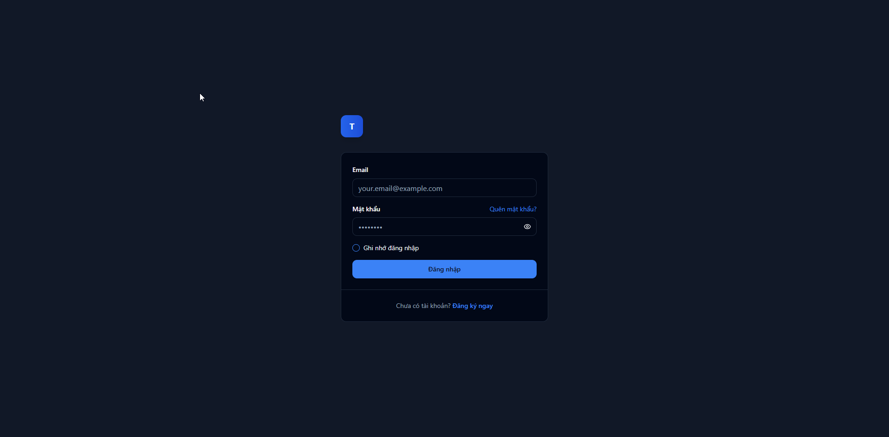

# 3. NỀN TẢNG (THE BASICS)

Chào mừng bạn đến với trái tim của Twin AI! Trong chương này, chúng tôi sẽ cùng bạn khám phá các khái niệm và kỹ năng cốt lõi để biến Twin AI thành một trợ thủ đắc lực trong công việc hàng ngày. 

Hãy bắt đầu từ việc làm quen với không gian làm việc, sau đó học cách "đối thoại" hiệu quả với AI và cuối cùng là tổ chức công việc một cách khoa học.

## Nội dung chính

### [3.1. Không gian làm việc của bạn](./workspace)
🖥️ Tìm hiểu và làm quen với các thành phần chính trên giao diện Twin AI

**Bạn sẽ học được:**
- Cách điều hướng trong giao diện Twin AI
- Hiểu rõ chức năng của từng khu vực làm việc
- Thiết lập môi trường làm việc tối ưu

### [3.2. Nghệ thuật Đối thoại cùng Twin AI](./conversation-art)
🗣️ Nắm vững nguyên tắc viết prompt hiệu quả để khai thác 100% sức mạnh của AI

**Bạn sẽ học được:**
- Công thức 4 thành tố của một prompt hiệu quả
- Kỹ thuật prompt nâng cao
- Cách sử dụng tệp đính kèm để cung cấp ngữ cảnh
- Các lưu ý quan trọng khi giao tiếp với AI

### [3.3. Quản lý công việc với "Projects"](./project-management)
📁 Học cách tổ chức công việc một cách khoa học và gọn gàng theo từng dự án

**Bạn sẽ học được:**
- Tạo và quản lý Projects hiệu quả
- Tổ chức nội dung và tài liệu trong Project
- Tips và best practices cho việc sử dụng Projects
- Các tính năng nâng cao cho team

## Tại sao chương này quan trọng?

Nắm vững nền tảng này sẽ giúp bạn:

- ⚡ **Tiết kiệm thời gian**: Làm việc hiệu quả ngay từ lần đầu sử dụng
- 🎯 **Kết quả chính xác**: Biết cách ra lệnh để được kết quả mong muốn
- 📈 **Tăng năng suất**: Tổ chức công việc khoa học, dễ theo dõi và cộng tác
- 🔄 **Workflow mượt mà**: Chuyển đổi giữa các dự án một cách liền mạch

## Cách học hiệu quả

1. **Đọc tuần tự**: Bắt đầu từ 3.1 → 3.2 → 3.3
2. **Thực hành ngay**: Áp dụng ngay từng bài học vào công việc thực tế
3. **Thử nghiệm**: Đừng ngại thử các kỹ thuật mới với Twin AI
4. **Ghi chú**: Lưu lại những prompt và cách làm hiệu quả nhất với bạn

---

**Sẵn sàng bắt đầu?** Hãy bước vào [Không gian làm việc của bạn](./workspace) để khám phá giao diện Twin AI!

