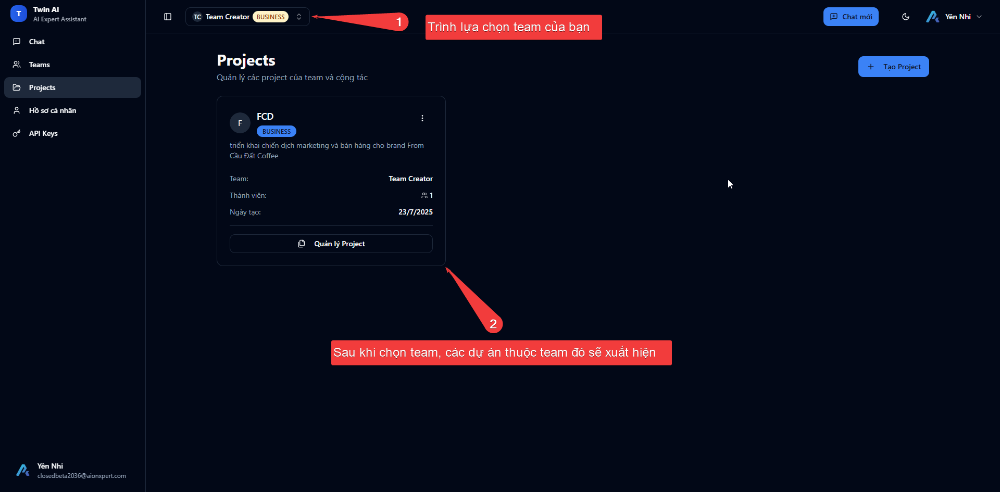

# 3.3. Quản lý công việc với "Projects"

Hãy nghĩ về "Projects" như những thư mục riêng biệt cho từng chiến dịch, từng khách hàng, hoặc từng mục tiêu công việc của bạn. Việc sử dụng Projects giúp bạn giữ cho không gian làm việc luôn gọn gàng và có tổ chức.

*Không gian quản lý Projects trong Twin AI*

## Tại sao bạn nên dùng "Projects"?

• **Tổ chức**: Tập hợp tất cả các cuộc hội thoại và tài liệu liên quan đến một công việc vào cùng một nơi.

• **Tập trung**: Dễ dàng chuyển đổi giữa các bối cảnh công việc khác nhau mà không bị rối.

• **Cộng tác**: Từ gói Pro trở lên, bạn có thể mời các thành viên trong team vào một Project cụ thể để cùng nhau làm việc (xem thêm ở [Quản Lý Team Của Bạn](../teams/))

• **Context Memory**: Twin AI sẽ nhớ toàn bộ ngữ cảnh và lịch sử làm việc trong từng Project riêng biệt

## Video Demo: Quản lý Projects

<iframe src="https://cdn.iframe.ly/LHfDwAVv" style="top: 0; left: 0; width: 100%; height: 100%; position: absolute; border: 0;" allowfullscreen allow="clipboard-write *; fullscreen *;"></iframe>

*Video hướng dẫn chi tiết cách tạo và quản lý Projects trong Twin AI*

## Tạo và Quản lý Projects

### Tạo Project mới:

1. Từ trang chủ  Twin AI, Click vào "Project" từ menu ở sidebar trái để vào trình quản lý dự án của từng Teams. Click vào nút **"New Project"** hoặc biểu tượng **"+"** ở góc trên bên trái
2. Nhập tên cho Project của bạn (ví dụ: "Chiến dịch Marketing Q4", "Dự án Website ABC", v.v.)
3. Thêm mô tả ngắn gọn về Project (tùy chọn)
4. Chọn các thành viên team nếu đây là project cộng tác
5. Click **"Create"** để hoàn tất

### Quản lý Project:

1. **Truy cập Project**: Click vào tên Project từ danh sách ở sidebar trái
2. **Đổi tên Project**: Click vào biểu tượng "⚙️" > "Project Settings" > chỉnh sửa tên
3. **Thêm/xóa thành viên**: Vào Settings > "Members" 
4. **Xóa Project**: Vào Settings > "Delete Project" (lưu ý: hành động này không thể hoàn tác)

## Tổ chức Nội dung trong Project

### Cuộc hội thoại (Conversations):
- Mỗi cuộc hội thoại với Twin AI trong Project sẽ được lưu tự động
- Đặt tên rõ ràng cho từng cuộc hội thoại để dễ theo dõi
- Sử dụng tính năng "Pin" để ghim những cuộc hội thoại quan trọng lên đầu
- Twin AI sẽ nhớ context từ các cuộc hội thoại trước đó trong cùng Project

### Tài liệu và Files:
- Upload tài liệu liên quan trực tiếp vào Project thông qua phần **"Project Knowledge"**
- Twin AI sẽ nhớ context của tất cả tài liệu trong Project
- Các file được chia sẻ cho toàn bộ thành viên trong Project

### Các loại tệp được hỗ trợ:
- **Tài liệu**: PDF (.pdf), Word (.docx, .doc), PowerPoint (.pptx)
- **Bảng tính**: Excel (.xlsx), CSV (.csv)
- **Văn bản**: Text files (.txt), Markdown (.md)
- **Hình ảnh**: JPG, PNG

## Tips sử dụng hiệu quả

### 1. Đặt tên Project có ý nghĩa
- ✅ "Chiến dịch Digital Marketing Q1 2024"
- ✅ "Dự án Website Renovation - ABC Corp"
- ✅ "Nghiên cứu thị trường - Sản phẩm X"
- ❌ "Project 1", "Untitled", "Test"

### 2. Sử dụng Project cho từng mục đích riêng biệt
- **Công việc**: Một Project cho mỗi dự án/khách hàng
- **Học tập**: Một Project cho mỗi môn học/khóa học
- **Cá nhân**: Một Project cho các kế hoạch cá nhân
- **Nghiên cứu**: Một Project cho mỗi chủ đề nghiên cứu

### 3. Tận dụng tính năng context sharing
- Khi bạn chat trong một Project, Twin AI sẽ hiểu toàn bộ ngữ cảnh của Project đó
- Lưu câu trả lời của Twin trong các cuộc hội thoại thành **"Project Knowledge"** làm tài liệu tham chiếu mới
- Không cần phải giải thích lại từ đầu về dự án bạn đang làm
- AI sẽ tham chiếu đến các cuộc hội thoại và tài liệu trước đó trong cùng Project

### 4. Quản lý Project hiệu quả
- **Sử dụng mô tả**: Luôn thêm mô tả ngắn gọn cho Project để team hiểu rõ mục đích
- **Regular review**: Định kỳ review và archive những Project đã hoàn thành  
- **Phân quyền rõ ràng**: Chỉ mời những thành viên thực sự cần thiết vào Project
- **Backup quan trọng**: Export những cuộc hội thoại quan trọng để lưu trữ

### 5. Best Practices cho Team
- **Naming convention**: Thống nhất cách đặt tên Project trong team
- **Project templates**: Tạo template Project cho các loại công việc thường gặp
- **Status tracking**: Sử dụng tên Project hoặc mô tả để theo dõi trạng thái (Draft, In Progress, Review, Completed)
- **Handover**: Khi chuyển giao Project, đảm bảo tài liệu và context đầy đủ

## Các tính năng nâng cao

### Project Templates (Gói Pro+):
- Tạo template Project với cấu trúc và tài liệu mẫu
- Nhanh chóng tạo Project mới từ template có sẵn
- Chuẩn hóa quy trình làm việc trong team

### Project Analytics (Gói Enterprise):
- Theo dõi hoạt động và hiệu suất của Project
- Thống kê usage và engagement của team members
- Insight về các pattern làm việc hiệu quả

---

**Lưu ý**: Tính năng Project là nền tảng để bạn làm việc hiệu quả với Twin AI. Hãy dành thời gian thiết lập và tổ chức Projects một cách khoa học từ đầu để tối ưu hóa workflow của bạn.

**Bước tiếp theo:** Tìm hiểu về [Quản lý Teams](../teams/) để cộng tác hiệu quả với đồng nghiệp trong các Projects.

