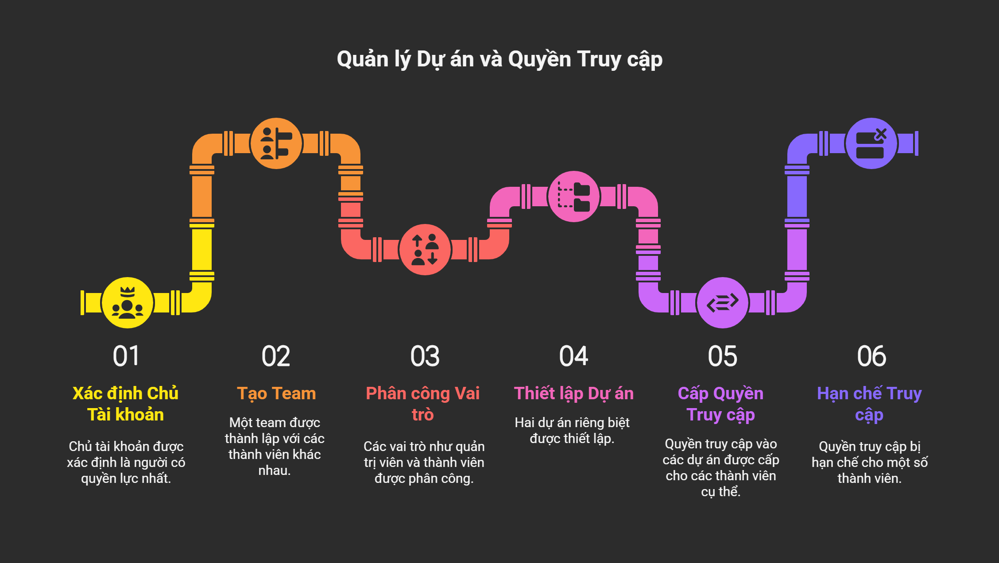

# 4.2. Cộng tác trong "Projects":

Một khi Team của bạn đã được thiết lập, bạn có thể bắt đầu cộng tác bằng cách gán Thành Viên trong Team vào các "Projects" cụ thể. Điều này đảm bảo rằng đúng người sẽ có quyền truy cập vào đúng thông tin và công việc.

## Minh họa quyền truy cập vào dự án của các thành viên trong team

## Hướng dẫn thêm thành viên Team cộng tác trong một Project

  <iframe src="https://cdn.iframe.ly/uVjxaJiK" 
          style="width: 100%; height: 100%; position: absolute; top: 0; left: 0; border: 0;" 
          allowfullscreen 
          allow="clipboard-write; fullscreen">
  </iframe>

